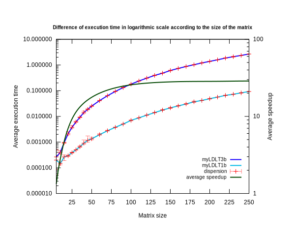
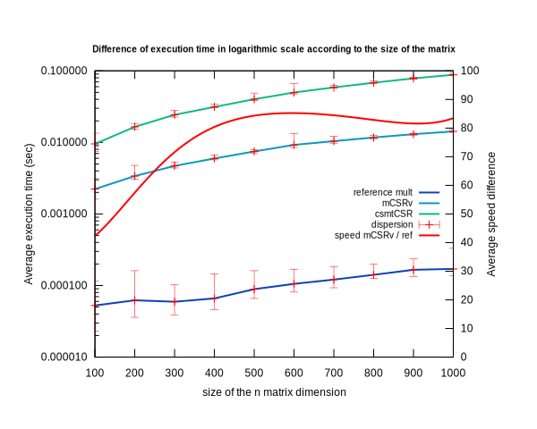
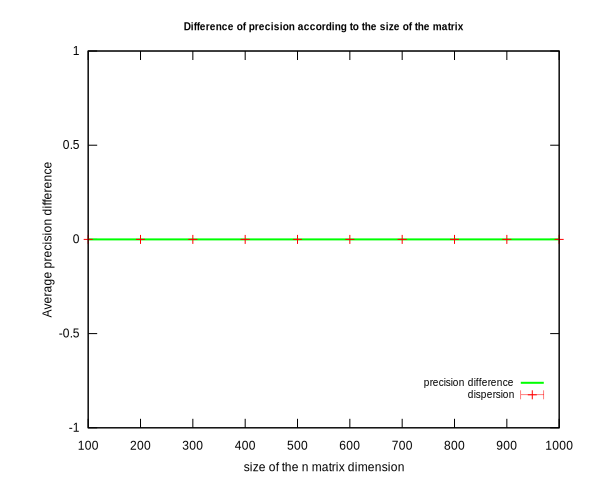
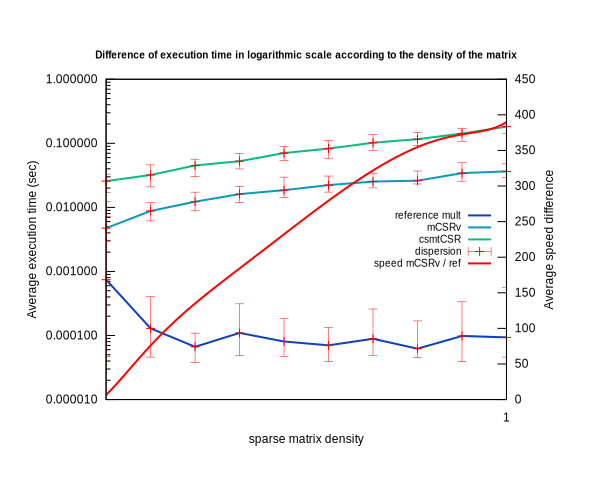

# **Rendu Calcul Numérique TP 4 et 5 :** *Exploitation des structures des matrices & Application à l'équation de la chaleur 1D stationnaire*

# TP4 : Exercice 1 - Factorisation $LDL^T$ pour $A$ symétrique
> On cherche à résoudre l'équation $A*x=b$. Pour ceci, on va simplifier par la résolution de deux systèmes triangulaires $L*y = B$ et $U*x = y$. 

Dans le cas d'une matrice symétrique, la décomposition $A = L*U$ correspond à la factorisation de Cholesky $A = L*L'$ où la matrice triangulaire supérieure U est la transposée de L (L').

Dans la décomposition de Cholesky alternative $A = L*D*L'$, D correspond à la diagonale de la matrice A.

## Existence et unicité de la factorisation $A = L*U$


> On cherche à montrer que la matrice A possède une décomposition LU.

On suppose que toutes les sous-matrices de A sont inversibles.

Avec A une matrice de taille $n = 1$, on a alors $A = (a)$ avec $a != 0$ car a inversible. 
Une décomposition $A = LU$ existe alors, avec $L = (1)$ et $U = (a)$.

On peut prouver par récurrence que $A$, matrice inversible de taille n+1 possède une décomposotion $LU$, en supposant que la sous matrice An est inversible, et que la propriété est vraie au rang n ($An = Ln * Un$)

On aurais alors une décomposition $LU$ de $An+1$ est alors $An+1 = Ln+1 * Un+1$, avec :

$Ln+1 = \begin{pmatrix}Ln & 0\\ Rn & 1 \end{pmatrix}\ \ et\ \ \ Un+1 = \begin{pmatrix}Un & Cn\\ 0 & \lambda n \end{pmatrix}$ avec $Rn$ un vecteur ligne, $Cn$ un vecteur colonne et $\lambda n$ un scalaire.

En posant la matrice $An+1$ on aurais alors $\begin{pmatrix}An & An'\\ An'' & An''' \end{pmatrix} = \begin{pmatrix}Ln & 0\\ Rn & 1 \end{pmatrix} \begin{pmatrix}Un & Cn\\ 0 & \lambda n \end{pmatrix}$

Il ne nous reste alors plus qu'à faire cette multiplication de matrices, d'où on obtiens les équations suivantes : 
- $An = Ln * Un$ (on retrouve ici notre hypothèse)
- $An' = Ln * Cn \Leftrightarrow Cn = Ln^{-1} * An'$
- $An'' = Rn*Cn \Leftrightarrow Rn = Un^{-1} * An''$
- $An''' = Rn*Cn + \lambda n \Leftrightarrow \lambda n = An''' - Rn*Cn \Leftrightarrow An''' - (Un^{-1}*An'')(Ln^{-1}*An')$

Si la décomposition LU existe pour $An+1$ à partir de $An$, alors pour une $A$ matrice inversible, dont les mineures sont inversibles, $A$ possède une décomposition $LU$.

\- *d'après [¹](#references)*

> On cherche à prouver que si $A$ possède une décomposition $LU$, alors celle-ci est unique

Supposons que A ait les décompositions $A = L1*U1$ et $A = L2*U2$.

Par définition, $L1*U1 = L2*U2$. On multiplie l'équation par $L2^-1 * U1^-1$

- $L1*U1 = L2*U2$
- $\Leftrightarrow L2^{-1} * L1 * U1^{-1} * U1 = L2 * L2^{-1} * U2 * U1^{-1}$
- $\Leftrightarrow L2^{-1} * L1 * I = I * U2 * U1^{-1}$

Puisque $L2^{-1}$ et $L1$ sont des matrices triangulaires inférieures, $U2$ et $U1^{-1}$ sont des matrices triangulaires supérieures, ce système ne possède qu'une seule solution : $L2^{-1} * L1 = U2 * U1^{-1} = I$, impliquant que $L1 = L2$ et $U1 = U2$.

\- *d'après [²](#references)*

> On cherche alors à montrer que si $A$ est symétrique, alors il existe une factorisation $A = LDL^T$.

Si possède une factorisation $LU$, alors on peut écrire $A$ sous la forme $A = LD^{-1}V$, où $DV = U$, avec $V$ une matrice triangulaire supérieure avec diagonale unitaire.

$A$ étant symétrique, on peut écrire $A = LDV \Leftrightarrow A = V^TDL^T = A^T$.

Puisque $A = LU$ ne possède qu'une seule solution, on trouve alors $L = V^T$, $V$ étant alors la matrice triangulaire inférieure à diagonale unitaire et $DL^T$ la matrice triangulaire supérieure. L'unicité de $A = LDL^T$ découle de l'unicité de $A=LU$.

\- *d'après [³](#references)*

## On va désormais implémenter un algorithme sur Scilab pour une factorisation $LDL^T$


> Première implémentation, **décomposition naïve de Cholesky** :
```scilab
function [L, D] = myLDLT3b(A)
    n = size(A, "r");

    L = eye(n, n);
    d = zeros(n);
    v = zeros(n);

    for i = 1:n
        u = 0;
        for j = 1 : i-1
            v(j) = L(i,j) * d(j);
            u = u + L(i,j) * v(j);
        end
        d(i) = A(i,i) - u;
        for j = i+1:n
            w = 0
            for k = 1:i-1
                w = w + L(j,k) * v(k)
            end
            L(j,i) = (A(j,i) - w) / d(i);
        end
    end
    D = zeros(n,n);
    for j=1:n
        D(j,j) = d(j);
    end
endfunction
```

Cet algorithme a une complexité approximée en $O(n³)$, du fait de ses trois imbrications de boucles.

Vérification des résultats.

```scilab
// Afin de vérifier nos fonctions, on utilisera cette méthode pour la suite.

// 1. Création d'une matrice carrée symétrique, de taille <size> (matrice valeur réelle).
x = rand(size, size);
A = x*x'

// 2. Calcul de la matrice approchée, via la fonction testée.
[D, L] = myLDLT3b(A)

// 3. On regarde la norme de la différence entre la matrice réelle (A) et celle calculée (L*D*L'). La norme correspond ici à la plus grande valeur singulière de la matrice différence entre la matrice réelle et celle calculée.
norm(A - L*D*L')
```

> Seconde implémentation, par **adaptation de la décomposition LU** :

En prenant compte que dans le cas d'une matrice symétrique, $U = L'$, on peut adapter la fonction optimisée en une seule boucle faite au TP précédent, `mylu1b`, et l'ajuster pour obtenir $L$ et $D$.

L reste alors identique, on n'a plus besoin de U, et on implémente D.

```scilab
function [L, D] = myLDLT1b(A)
    n = size(A, "r");
    for k = 1 : n-1
        A(k+1:n,k) = A(k+1:n, k) / A(k,k)
        A(k+1:n, k+1 : n) = A(k+1:n, k+1 : n) - A(k+1:n, k)*A(k,k+1 : n)
    end

    L = tril(A, -1);
    // L = L + eye(n,n)
    for i = 1:n
        D(i, i) = A(i, i);
        L(i, i) = 1;
    end
endfunction
```

Cet algorithme est de complexité $O(n-1)$, du fait de son unique boucle. Les boucles inline ne sont pas comptées dans la complexité.

## Comparaison des deux fonctions.

(*scilab*) Exécution des fonctions sur tailles de matrices de 5 à 50 avec un pas de 5 puis de 60 à 250 avec un pas de 10.
5 Itérations pour chaque taille de matrice.
```scilab
LDLT_bench_comparaison([linspace(1,50,10), linspace(60,250,20)], 5)
```
(*shell*) Représentation graphique
```shell
gnuplot LDLT_bench_comparaison.p
```

Un rapide test de performance, en utilisant la méthode décrite précédemment, indique une nette amélioration du temps d'exécution de la seconde fonction. Sur de grosses matrices, de tailles supérieures à 80, l'utilisation de la seconde fonction réduit le temps d'exécution d'environ 30 fois.


- Figure 1 : Différence du temps d'exécution en échelle logarithmique en fonction de la taille de la matrice


- Figure 2 : Différence de précision en échelle logarithmique en fonction de la taille de la matrice.

Si la seconde fonction est bien plus rapide que la première, l'erreur commise `norm(L*D*L' - A)` augmente également, d'un facteur moyen d'ordre de grandeur 10

Dans les deux cas, la précision moyenne reste au moins d'ordre $e^{-12}$ pour chaque exécution, ce qui reste acceptable. 

On priviliégera alors la seconde fonction `myLDLT1b` pour la suite, pour de grandes matrices.


# TP4 : Exercice 5 - Produit Matrice Vecteur Creux

> Dans cet exercice, on cherche à écrire un algorithme permettant de calculer le produit d'une matrice creuse A de m lignes et n colonnes avec un vecteur de longueur n

Dans le format CSR, une matrice creuse A de taille m lignes * n colonnes est stockée sous forme de trois vecteurs [⁴](#references) :
- AX : vecteur contenant les coefficients non nuls de A, ligne par ligne. Contient nz éléments non nuls de A.
- AJ : vecteur de taille nz contenant les indices colonnes de chaque coefficient du vecteur AX. Pour tout k de 1 à $nz$, $AJ(k)$ correspond à l'indice colonne de $AX(k)$.
- AI : vecteur de taille m+1 contenant les indices dans AX de chaque début (et donc aussi de fin) de ligne. Pour chaque ligne k, les éléments non nuls de $A(k,:)$ sont placés dans AX de l'indice $AI(k)$ à $AI(k+1)$

Pour ce faire, nous allons utiliser deux fonctions, `csmtCSR` et `mCSRv`.

Le premier algorithme, `csmtCSR` (Convert Sparse Matrix To CSR) effectue, comme son nom l'indique, une conversion d'une matrice creuse vers un stockage CSR.
- En entrée : une matrice A, matrice réelle ou matrice creuse générée par la commande scilab `sprand`.
- En sortie : `AX, AI et AJ`, les matrices correspondantes au stockage CSR de la matrice A.
```scilab
function [AX, AI, AJ] = csmtCSR(A)
    [m,n] = size(A);
    pos = 1;
    AI = zeros(1,m+1);
    AJ = zeros(1,0);
    AX = zeros(1,0)
    for i=1:m
        for j=1:n
            if A(i,j) ~= 0 then
                AX = [AX, A(i,j)];
                AJ = [AJ, j];
                pos = pos + 1
            end
        end
        AI(i+1) = pos-1;
    end
    AX = full(AX)
endfunction
```

Cet algorithme est de complexité $O(m*n)$, du fait de ses deux boucles.

Le second algorithme, `mCSRv` (Multiplication CSR vector) effecture, comme son nom l'indique, une multiplication de matrice stockée sous format SCR par un vecteur.
- En entrée : `AX, AI, AJ`, les matrices stockages CSR, et `v`, le vecteur multiplicateur
- En sortie : `Av`, la matrice AX multipliée par v. Les autres matrices `AI et AJ` du stockage CSR ne sont pas affectés par l'opération.
```scilab
function [Av] = mCSRv(AX, AI, AJ, v)
    n = size(AI, 'c');
    Av = zeros(1,n-1);
    for i = 1:n-1
        jstart = AI(i);
        jend = AI(i+1);
        for j =jstart+1:jend
            Av(i) = Av(i) + AX(j) * v(AJ(j))
        end
    end
endfunction
```

La complexité de cet algorithme est de `nz` avec nz étant le nombre d'éléments non nuls de la matrice. Dans le pire des cas, pour une matrice pleine de taille m*n (matrice creuse à densité 1), `nz = m*n`.


> ## Vérification des résultats.

Afin de tester nos algorithmes, la méthode suivante est utilisée.

```scilab
// Une matice creuse sp, de taille m*n est créée, de densité density.
sp = sprand(m,n,density);

// Génération de la matrice réelle pleine, à partir de la matrice creuse, complétée par des valeurs nulles.
A = full(sp);

// Génération d'un vecteur multiplicateur aléatoire entre 0 et 1, avec une probabilité p.
v = grand(n,1, "bin", 1, p);

// Conversion de notre matrice creuse en stockage CSR
[AX, AI, AJ] = csmtCSR(sp);

// Multiplication en stockage CSR
xex = mCSRv(AX, AI, AJ, v);

// Valeur réelle
x = (A*v)';

// Vérification des résultats
norm(x - xex)
```

(scilab) Exécution des fonctions sur une matrice de taille `m = 50, n = 100`, de densité `density = 0.1` et avec vecteur avec probabilité `p = 1`.

```scilab
// Premier test pour un vecteur x = (1,1,...,1)'
sp = sprand(50,400,0.3);
A = full(sp);
v = grand(400,1, "bin", 1, 1);
[AX, AI, AJ] = csmtCSR(sp);
xex = mCSRv(AX, AI, AJ, v);
x = (A*v)';
norm(x - xex)
```

Puisque la norme de (x-xex) est nulle, on peut assurer que x et xex sont égaux. L'algorithme fonctionne pour un vecteur unitaire complet.

```scilab
// Second test pour un vecteur x = (1,0,0,1,0,0,...,1,0,0)'
sp = sprand(50,300,0.3);
A = full(sp);
v = zeros(300,1);
for i=1:3:300 v(i) = 1; end
[AX, AI, AJ] = csmtCSR(sp);
xex = mCSRv(AX, AI, AJ, v);
x = (A*v)';
norm(x - xex)
```

Puisque la norme de (x-xex) est nulle dans nos deux tests, on peut assurer que x et xex sont égaux. L'algorithme fonctionne pour des vecteurs unitaires complets ou avec motif répétitif.

> ## Mesures de performance.

```scilab
exec('CSR_bench_comparaison.sce', -1);
CSR_bench_comparaison(100,linspace(100,1000,10), 20, 0.1)
```

Le premier test compare la différence de performances et de précision entre la valeur réelle et notre fonction, pour des tailles de matrices `m = 100` et `n de 100 à 1500 avec pas de 100`, une densité matricielle de `density=0.1` et la probabilité de remplissage du vecteur `p = 1`. On itère 20 fois pour chaque paramètre changé.

```scilab
exec('CSR_bench_comparaison.sce', -1);
CSR_bench_comparaison_density(100,200, 20, linspace(0.1,1,10))
```
Le second test compare la différence de performances d'exécution de nos fonctions pour des density de 0.1 à 1, avec un pas de 0.1, sur une matrice de taille `m = 100, n = 200` et la probabilité de remplissage du vecteur `p = 1`.

```shell
gnuplot CSR_bench_comparaison.p
```
On trace les résultats avec gnuplot.

On obtient les graphes suivants : 


- Figure 3 : Différence du temps d'exécution en échelle logarithmique des fonctions `mCSRv`, `csmtCSR` et calcul référence fonction de la taille de ka dimension n de la matrice d'entrée.


- Figure 4 : Différence de précision en fonction de la taille de la dimension n de la matrice d'entrée


- Figure 5 : Différence du temps d'exécution en échelle logarithmique des fonctions `mCSRv`, `csmtCSR` et calcul référence fonction de la densitée de la matrice creuse d'entrée.

Note : *La courbe différence du temps d'exécution porte sur la différence entre le temps d'exécution de `mCSRv` et ed la fonction référence basique de scilab.
Le temps d'exécution de la fonction `csmtCSR` n'entre pas en compte dans cette courbe.*

Le graphe (4) nous confirme la fiabilité de nos fonctions, en effet la différence de précision est nulle, donc sans perte de précision.

Le graphe (3) et (5) nous indiquent, sans surprise, que l'augmentation de taille de matrice creuse d'entrée ainsi que sa densité augmente le nombre de calculs de nos fonctions, et par conséquent du temps d'exécution.

Sur la majorité des exécutions, notre algorithme est borné par une lenteur d'ordre de grander 10² par rapport au calcul matrice pleine vecteur de scilab, sur des matrices de tailles 200\*100 à 200\*1000 et un vecteur de taille 100 à 1000

On observe sur le second graphique (5) une évolution linéaire de la différence de temps d'exécution de nos fonctions par rapport au calcul matrice pleine vecteur de scilab, jusqu'à 400 fois supérieure sur une matrice "creuse" de densité 1 (donc pleine) de taille 200*100 par un vecteur unitaire plein de taille 100. 
C'est 4 fois supérieur à la borne 10² observée sur le premier graphique (3).

> Notre algorithme est plus performant sur des matrices creuses à faibles densités, comme peut évoquer la courbe d'évolution linéaire de différence de temps d'exécution (en rouge) sur le graphique (5).
> En effet, un stockage CSR n'aurais peu de sens sur une matrice creuse à forte densité.

> Comme observé, les opérations au format CSR coûte plus cher que les opérations au format matrice pleine dans scilab. Cela devra être pris en compte en fonction du nombre d'opérations effectuées. Par exemple, si on s'arrête à une mulitplicaiton matrice creuse par vecteur, il sera préférable d'effectuer en premier la multiplication puis ensuite stocker le résultat au format CSR.

La plupart du temps d'exécution se passe dans la fonction de convertion `csmtCSR`, sur la réaffectation de AX et AJ pour ajouter un élément, ne connaissant pas à l'avance le nombre d'éléments nons nuls dans la matrice.
Une première tentative d'optimisation a été par l'utilisation de la fonction scilab `resize_matrix` puis en second lieu avec une première itération sur la matrice pour connaître la taille d'initialisation des matrices, et initialiser AX et AJ une seule fois ensuite, mais ces deux tentatives ont donné des résultats pires encore.

> Bien que le stockage CSR coûte en temps de d'exécution sur scilab, il est important de noter que le stockage CSR réduit dans l'algorithme considérablement le nombre d'opérations.

> Rappels des complexités des algorithmes :
- $m*n*n$ pour le calcul naïf en matrice stockage plein (référence)
- $nz$ pour `mCSRv`
- $nz$ pour `csmtCSR`

avec $nz$ est le nombre d'éléments non nuls de la matrice. Dans le pire des cas, $nz = m*n$.

> Différence de stockage mémoire pour une matrice de taille m*n : 
- $m*n$ pour un stockage matrice pleine
- $2*nz + n+1$ pour un stockage CSR (*)

*\* pour le stockage CSR, les matrices AJ et AX sont de tailles $nz$ et AI est de taille n+1*

Pour que le stockage en CSR soit rentable, d'un point de vue mémoire occupée, il faut que $2*nz + n+1 < m*n$.

En pratique, pour une matrice creuse de taille `m*n` et de densité `d`, on a `nz = d * m*n` : 
- $2*nz + n+1 < m*n  \Leftrightarrow 2(d*m*n) + n+1 < m*n$
- $2*nz + n+1 < m*n  \Leftrightarrow n+1 < m*n(1-2*d)$
- $2*nz + n+1 < m*n  \Leftrightarrow 1 + 1/n < m*(1-2*d)$
- $2*nz + n+1 < m*n  \Leftrightarrow (1 + 1/n)/m < 1-2*d$
- $2*nz + n+1 < m*n  \Leftrightarrow 1/m + 1/mn < 1-2*d$
- $2*nz + n+1 < m*n  \Leftrightarrow 1/m + 1/mn -1 < -2*d$
- $2*nz + n+1 < m*n  \Leftrightarrow 1 - 1/m - 1/mn > 2*d$
- $2*nz + n+1 < m*n  \Leftrightarrow 0.5 - 1/2m - 1/2mn > d$

Pour des grandes matrices, `1/2m et 1/2mn` tendent vers 0.

> On peut alors considérer que pour que le stockage CSR soit rentable d'un point de vue mémoire, il faut que d soit borné par 0.5

> Différence d'opérations pour une matrice de taille m*n par vecteur de taille n:
- $m(n²)$ multiplications + $m((n-1)n)$ additions pour un stockage matrice pleine
- $nz$ multiplications + $nz$ additions (*)

*\*On ne considère ici qu'uniquement la différence d'algorithmes de multiplications, à savoir `mCSRv`.*

Pour que le stockage CSR soit rentable d'un point de vue opérations, il faut que $2*nz < m*(n*n) + m*((n-1)*n)$
- $2*nz < m*(n*n) + m*((n-1)*n) \Leftrightarrow 2*d*m*n < m*n² + m*n² - mn$
- $2*nz < m*(n*n) + m*((n-1)*n) \Leftrightarrow (2*d+1)*m*n < 2m*n²$
- $2*nz < m*(n*n) + m*((n-1)*n) \Leftrightarrow 2*d+1 < 2n$
- $2*nz < m*(n*n) + m*((n-1)*n) \Leftrightarrow 2*d < 2n -1$
- $2*nz < m*(n*n) + m*((n-1)*n) \Leftrightarrow d < n - 0.5$

Si on considère `n = 1`, on a `d < 0.5` condition déjà recommandée pour rentabiliser le stockage CSR d'un point de vue mémoire.

Par ailleurs, d est par définition borné entre 0 et 1. Si n > 1, alors le stockage CSR est forcément rentable d'un point de vue nombre d'opérations à effectuer.

Nb : ici ne sont pas prises en compte les accès mémoires, plus coûteux que les opérations. CSR demandera moins d'accès mémoires qu'en matrice pleine, du fait de son stockage en vecteurs.

> L'utilisation du stockage CSR pour des matrices creuses est toujours plus optimisé que le stockage matrice pleine, d'un point de vue du nombre d'opérations à effectuer.

> Bien ce que ceci ne se reflète pas sur scilab, le temps d'exécution devrait toujours être plus court en stockage CSR. Cela est très probablement dû à l'utilisation interne de fonctions déjà optimisées, contairement à notre algorithme, qui doit lui être interprété.


# **TP 5 : Résolution de l'équation de la chaleur en 1D stationaire**

Au cours de ce TP, nous cherchons à résoudre l'équation de la chaleur 1D stationnaire, avec implémentation d'algorithmes de résolution de systèmes linéaires.

# TP5 : Exercice 3 - Utilisation BLAS/LAPACK

Note : *De par des erreurs de compilations et de librairies manquantes sur le code de base, j'ai du installer `cblas`, et en accord avec la documentation [gnu](https://www.gnu.org/software/gsl/doc/html/usage.html), ajouter le flag de compilation `-lcblas`.*

> Attention, potentiellement besoin de modifier des appels à LAPACK en conséquence

1\. Pour utiliser Blas et Lapack, les matrices doivent être dans le format suivant: [⁵](#references)
- tableau à deux dimensions
- stockée en paquet pour les matrices symétriques [⁶](#references)
- stockée en bandes pour les matrices bandes [⁷](#references)
- en vecteurs pour les matrices tridiagonales ou bidiagonales

2\. La constante LAPACK_COL_MAJOR spécifie que le tableau passé en argument est stocké en colonnes. [⁸](#references)

3\. La dimension principale est la taille de la première dimension de la matrice. Si on est en LAPACK_COL_MAJOR, par exemple, alors c'est le nombre de colonnes de cette matrice.

4\. La fonction `dgbsv` calcule la solution d'un système linéaire `A*X = B` pour des matrices de doubles stockées en général bande. Elle implémente une décomposition LU. [⁹](#references)

5\. La vérification de nos codes se fait dans le fichier modifié, après make et exécution de tp2poisson1D_direct en changeant le paramètre `row` dans `tp2_poisson_direct`, on obtient une erreur résiduelle relative d'ordre $10e^{-15}$ en COL et ROW major.
La vérification de nos fonctions se fait dans le fichier `tp2_poisson1D_direct.c`, par le calcul de l'erreur résiduelle entre le `RHS` calculé et la solution attendue, `EX_SOL`.

En row major, le code était déjà implémenté, et indiquait une erreur résiduelle de $10^{-15}$. Après implémentation de la fonction `set_GB_operator_rowMajor_poisson1D` dans `lib_poisson1D.c`, et re-exécution du programme avec `row = 1`, on obtient également une erreur résiduelle de l'ordre de $10^{-15}$. 

L'implémentation `write_GB_operator_colMajor_poisson1D` a aussi permie de confirmer que la matrice générée correspondait à celle générée en row. 

Note : *Dans l'appel à `LAPACKE_dgbsv`, la matrice de taille `lab*la` contient `kv` lignes/colonnes (en fonction de si row ou col major) supplémentaires à la matrice AB à initialiser à 0. Ces emplacements superflus sont utilisés comme vecteur de calcul par la fonction `LAPACKE_dgbtrf`, appelée par `LAPACKE_dgbsv`. Cette étape est nécessaire, pour le bon fonctionnement de la `dgbsv`.*


# TP5 : Exercice 4  - DGBMV

> DGBMV implémente une multiplication matrice vecteur sur un stockage Général Bande.
$y = \alpha A x + \beta y$

A été implémenté : 

```c
// Création d'un vecteur de test y pour vérifier l'utilisation de DGBMV
double *y;
y=(double *) malloc(sizeof(double)*la);
for (int i = 0 ; i < la; i++) y[i] = i+1;

// Utilisation
cblas_dgbmv(CblasColMajor, CblasNoTrans, la, la, kl, ku, 0, AB, la, y, 1, 0, y, 1);
// * Paramètres : 
// Entrée        : CblasColMajor - stockage de A en col major
// Entrée        : CblasNoTrans - A n'a pas besoin d'être transposée.
// Entrée        : la, la - m*n, c'est à dire nombre de lignes et colonnes
// Entrée        : kl - nombre de sousdiagonales (1 dans le cas d'une matrice tridiagonale)
// Entrée        : ku - nombre de surdiagonales (1 dans le cas d'une matrice tridiagonale)
// Entrée        : 0 - alpha de l'équation.
// Entrée        : AB - la matrice de l'équation
// Entrée        : la - dimension principale de A.
// Entrée        : y - vecteur x de l'équation.
// Entrée        : 1 - incX. pas d'itération du vecteur x.
// Entrée        : 0 - beta de l'équation.
// Entrée/Sortie : y - vecteur y de l'équation.
// Entrée        : 1 - incY. pas d'itération du vecteur y.

// Sauvegarder le résultat de y
write_vec(y, &la, "dgbmv_y_col_a.dat");
```

Afin de vérifier l'utilisation de `cblas_dgbmv`, on fait varier avec les coefficients $\alpha$ et $\beta$. On teste alors les équations suivantes : 
- $\alpha=0$ et $\beta=0$. 
  - Le résultat $y$ attendu est alors $y = 0$
  - Le résultat obtenu est en effet $0$.
- $\alpha=0$ et $\beta=1$. 
  - Le résultat $y$ attendu est alors $y = 0* A x + 1*y = y$
  - Le résultat obtenu est en effet $y$. En changeant la valeur de $\beta$ pour 2 par exemple, on obtient correctement $y = \beta y$.
- $\alpha=1$ et $\beta=0$. 
  - Le résultat $y$ attendu est alors $y = 1*A x + 0* y = Ax$
  - Malheuresement, le résultat obtenu est un vecteur nul.
  Sur le principe, la multiplication $AB*y$ est correcte sur toutes les valeurs sauf la première et dernière. $0$ est en effet attendu car $-1 * 1 + 2 * 1 + (-1) * 1 = 0$ mais en première et dernière positon sont attendues les valeurs $-1*1+2*1 = 1$, ce qui n'était malheuresement pas le cas. En changeant les valeurs initiales de y, un vecteur vide est tout de même renvoyé.
  Malgré le temps passé dessus, je n'ai pas réussi à comprendre pourquoi un tel résultat ou alors où était mon erreur.
- $\alpha=1$ et $\beta=1$.
  - Le résultat $y$ attendu est alors $y = 1*A x + 1* y = Ax+y$
  - Eest renvoyé un vecteur aléatoire, vecteur unitaire 1, dont les 5 premières valeurs ne correspondent à rien d'attendu. Cela n'est pas très étonnant, dans la mesure où le test précédent a échoué.

La même batterie de tests a aussi été effectuée en **row major**, et les mêmes résultats ont été obtenus, à savoir les deux premiers tests sont positifs, le troisième est un vecteur vide, et le 4ème un vecteur résutat incohérent.

> Bien que le choix de passer en argument une taille de matrice `M*N = la * la`, me semble pertinent étant donné qu'il s'agit d'une matrice stockée en général bande, je pense estimer mon erreur à cet endroit, même si après multiples tests, la configuration actuelle est la plus correcte à mes yeux d'un point de vue logique et testée.


# References
1. [Décomposition LU et Choleski par Jean-Michel Ferrard @www.klubprepa.net](http://klubprepa.fr/Site/Document/ChargementDocument.aspx?IdDocument=5624) page 14 : Quelques démonstrations.
2. Cours Calcul Numérique par T. Dufaud
3. [Analyse Numérique Elémentaire @utc.fr](https://moodle.utc.fr/pluginfile.php/24405/mod_resource/content/15/MT09-ch2_ecran.pdf) page 51-52 : Factorisation $LDL^T$
4. [Analyse Numérique 2014-2015](https://math.unice.fr/~massonr/ANL3/20142015/TP5.pdf) Rappels format CSR.

5. [Documentation Lapack @netlib.org - Schémas de stockage des matrices](http://netlib.org/lapack/lug/node121.html)
6. [Documentation Lapack @netlib.org - Packed storage](https://www.netlib.org/lapack/lug/node123.html)
7. [Documentation Lapack @netlib.org - Stockage en bande](http://netlib.org/lapack/lug/node124.html)
8. [constantes Lapack col/row major @netlib.org](http://www.netlib.org/lapack/lapacke.html#_array_arguments)
9. [Lapack's DGBSV @netlib.org](http://www.netlib.org/lapack/explore-html/d3/d49/group__double_g_bsolve_gafa35ce1d7865b80563bbed6317050ad7.html)


# Annexes
[Github Repository](https://github.com/fm16191/-CHPS1-CN-TD4-5)