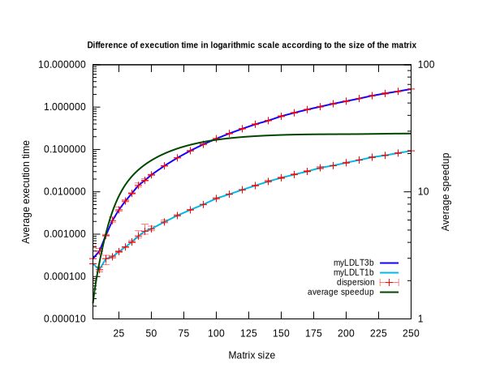
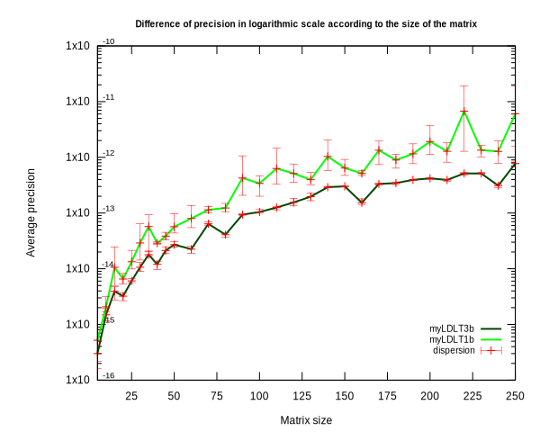

Rapport 2 - Feuille TD/TP 4 et 5 [dû au 27 Décembre 23h59 au plus tard]

[Moodle](https://moodle.uvsq.fr/moodle2022/mod/assign/view.php?id=36193)


Rapport au format .pdf < 2M.O 
Lien vers le dépôt git du suivi de vos codes.

    Contenu relatif au TD/TP 4 
        Exercice 1
            Implémenter l'algorithme de la factorisation LDL^T pour une matrice symétrique
            Tester et valider votre algorithme
            Mesurer les performances et comparer à la complexité théorique
            Comparer à LU
        Exercice 5 
            Implémenter un produit matrice vecteur creux pour le format CSR
            Tester et valider votre algorithme
    Contenu relatif au TD/TP 5 (à la date du 9 Décembre)
        Travail préliminaire et explication du cas test Poisson 1D
        Explication du code, de son architecture, des appels aux bibliothèques externes
        Explication du format de stockage et illustration des stockages en Row Major et Col Major
        Explication et validation des appels à dgbsv

    Contenu relatif au TD/TP 5 (à la date du 14 Décembre)
        Explication et validation des appels à dgbmv (en priorité ColMajor et mise en place des tests : si ça ne marche pas expliquer le résultat des tests)
        Implémentation du LU pour matrice tridiagonal (au format GB en C)
        Exercice Jacobi et Richardson avec implémentation Scilab
        (compte rendu des scéances TD avec M. El Arar et du TP avec M. Dufaud)


# Exercice 1 - Factorisation LDL^T pour A symétrique
> On cherche à résoudre l'équation `A*x=b`. Pour ceci, on va simplifier par la résolution de deux systèmes triangulaires `L*y = B` et `U*x = y`. 

Dans le cas d'une matrice symétrique, la décomposition A = L\*U correspond à la factorisation de Cholesky A = L\*L' où la matrice triangulaire supérieure U est la transposée de L (L').
Dans la décomposition de Cholesky alternative A = L\*D\*L', D correspond à la diagonale de la matrice A.

> Existence et unicité de la factorisation `A = L*U` [¹](#annexes)


On cherche à montrer que la matrice A possède une décomposition LU.

On suppose que toutes les sous-matrices de A sont inversibles.

Avec A une matrice de taille n = 1 : 

A = (a) avec a != 0 car a inversible

une décomposition A = LU existe, avec L = (1) et U = (a).

On cherche à montrer par récurrence que A, matrice inversible de taille n+1 possède une décomposotion LU.

On suppose que la sous matrice An est inversible, et que la propriété est vraie au rang n (`An = Ln * Un`).

Une décomposition LU de An+1 est alors An+1 = Ln+1 * Un+1, avec :

# TODO : écrire le paragraphe en propre.

> Unicité de la décomposition LU

Supposons que A ait les décompositions `A = L1\*U1` et `A = L2*U2`.

`L1\*U1 = L2*U2`

On multiplie l'équation par `L2^-1 * U1^-1`

<=> `L2^-1 * L1 * U1^-1 * U1 = L2 * L2^-1 * U2 * U1^-1`

<=> `L2^-1 * L1 * I = I * U2 * U1^-1`

L2^-1 et L1 sont des matrices triangulaires inférieures, U2 et U1^-1 sont des matrices triangulaires supérieures, impliquant que la seule solution de ce système est `L2^-1 * L1 = U2 * U1^-1 = I`, impliquant que `L1 = L2` et `U1 = U2`.


Première implémentation, **décomposition naïve de Cholesky** :
```scilab
function [L, D] = myLDLT3b(A)
    n = size(A, "r");

    L = eye(n, n);
    d = zeros(n);
    v = zeros(n);

    for i = 1:n
        u = 0;
        for j = 1 : i-1
            v(j) = L(i,j) * d(j);
            u = u + L(i,j) * v(j);
        end
        d(i) = A(i,i) - u;
        for j = i+1:n
            w = 0
            for k = 1:i-1
                w = w + L(j,k) * v(k)
            end
            L(j,i) = (A(j,i) - w) / d(i);
        end
    end
    D = zeros(n,n);
    for j=1:n
        D(j,j) = d(j);
    end
endfunction
```

Vérification des résultats.

```scilab
// Afin de vérifier nos fonctions, on utilisera cette méthode pour la suite.

// 1. Création d'une matrice carrée symétrique, de taille <size> (matrice valeur réelle).
x = rand(size, size);
A = x*x'

// 2. Calcul de la matrice approchée, via la fonction testée.
[D, L] = myLDLT3b(A)

// 3. On regarde la norme de la différence entre la matrice réelle (A) et celle calculée (L*D*L'). La norme correspond ici à la plus grande valeur singulière de la matrice différence entre la matrice réelle et celle calculée.
norm(A - L*D*L')
```

Seconde implémentation, **adaptation de la décomposition LU** :

En prenant compte que dans le cas d'une matrice symétrique, `U = L'`, on peut adapter la fonction optimisée en une seule boucle faite au TP précédent, `mylu1b`, et l'ajuster pour obtenir L et D.

L reste alors identique, on n'a plus besoin de U, et on implémente D.

```scilab
function [L, D] = myLDLT1b(A)
    n = size(A, "r");
    for k = 1 : n-1
        A(k+1:n,k) = A(k+1:n, k) / A(k,k)
        A(k+1:n, k+1 : n) = A(k+1:n, k+1 : n) - A(k+1:n, k)*A(k,k+1 : n)
    end

    L = tril(A, -1);
    // L = L + eye(n,n)
    for i = 1:n
        D(i, i) = A(i, i);
        L(i, i) = 1;
    end
endfunction
```

## Comparaison des deux fonctions.

(scilab) Exécution des fonctions sur tailles de matrices de 5 à 50 avec un pas de 5 puis de 60 à 250 avec un pas de 10.
5 Itérations pour chaque taille de matrice.
```scilab
LDLT_bench_comparaison([linspace(1,50,10), linspace(60,250,20)], 5)
```
(shell) Représentation graphique
```shell
gnuplot LDLT_bench_comparaison.p
```

Un rapide test de performance, en utilisant la méthode décrite précédemment, indique une nette amélioration du temps d'exécution de la seconde fonction. Sur de grosses matrices, de tailles supérieures à 80, l'utilisation de la seconde fonction réduit le temps d'exécution d'environ 30 fois.


- Figure 1 : Différence du temps d'exécution en échelle logarithmique en fonction de la taille de la matrice



- Figure 2 : Différence de précision en échelle logarithmique en fonction de la taille de la matrice.

Si la seconde fonction est bien plus rapide que la première, l'erreur commise `norm(L*D*L' - A)` augmente également, d'un facteur moyen d'ordre de grandeur 10

Dans les deux cas, la précision moyenne reste au moins d'ordre `e^-12` pour chaque exécution, ce qui reste acceptable. 

On priviliégera alors la seconde fonction `myLDLT1b` pour la suite, pour de grandes matrices.


# Annexes
1. [Décomposition LU et Choleski par Jean-Michel Ferrard @www.klubprepa.net](http://klubprepa.fr/Site/Document/ChargementDocument.aspx?IdDocument=5624) page 14 : Quelques démonstrations.

2. [Github Repository](https://github.com/fm16191/-CHPS1-CN-TD4-5)